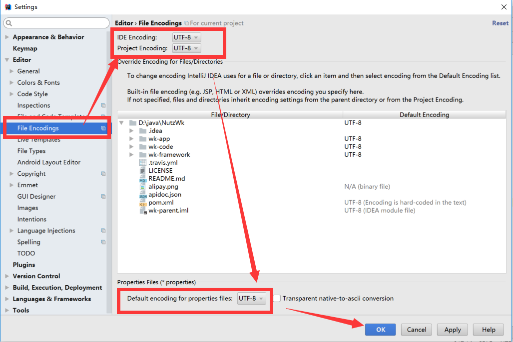
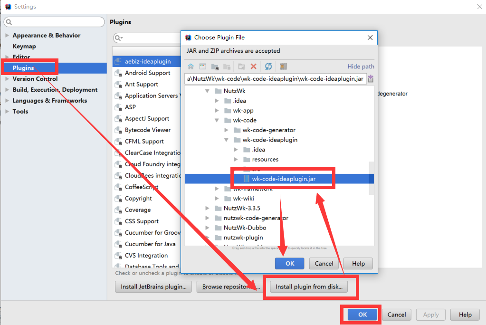

## 运行环境

* JDK 1.8 以上

* Maven 3.5.x 以上

* Tomcat 8.5.x 以上或 Jetty 9.3.x 以上

* MySQL 5.7 以上或 Oracle 、SqlServer 等数据库

## 打包
由于拆分了项目，使用方式略有不同，不了解maven的同学，需要先学习下maven，另外项目还用了lombok，需要安装lombok插件。
参考文档
https://gitee.com/naan1993/roses

1） 请先导入roses-kernel，根pom下执行
如下命令可以编译通过
```
mvn clean install -Dmaven.test.skip -Dgpg.skip
```

如下这个有问题，命令编译不过
```
mvn clean install -Dmaven.test.skip=true
```

2）roses-biz-support 编译同上
3）roses-cloud-support 编译同上
4）roses-system 编译同上
5) roses-gateway


## IDEA配置

File > Settings > File Encodings > All UTF-8



##  IDEA插件安装`可选`

File > Plugins > Install plugin from disk

选择代码生成器插件 wk-code-ideaplugin.jar 进行安装，安装成功后会提示重启IDEA，请重启IDEA


